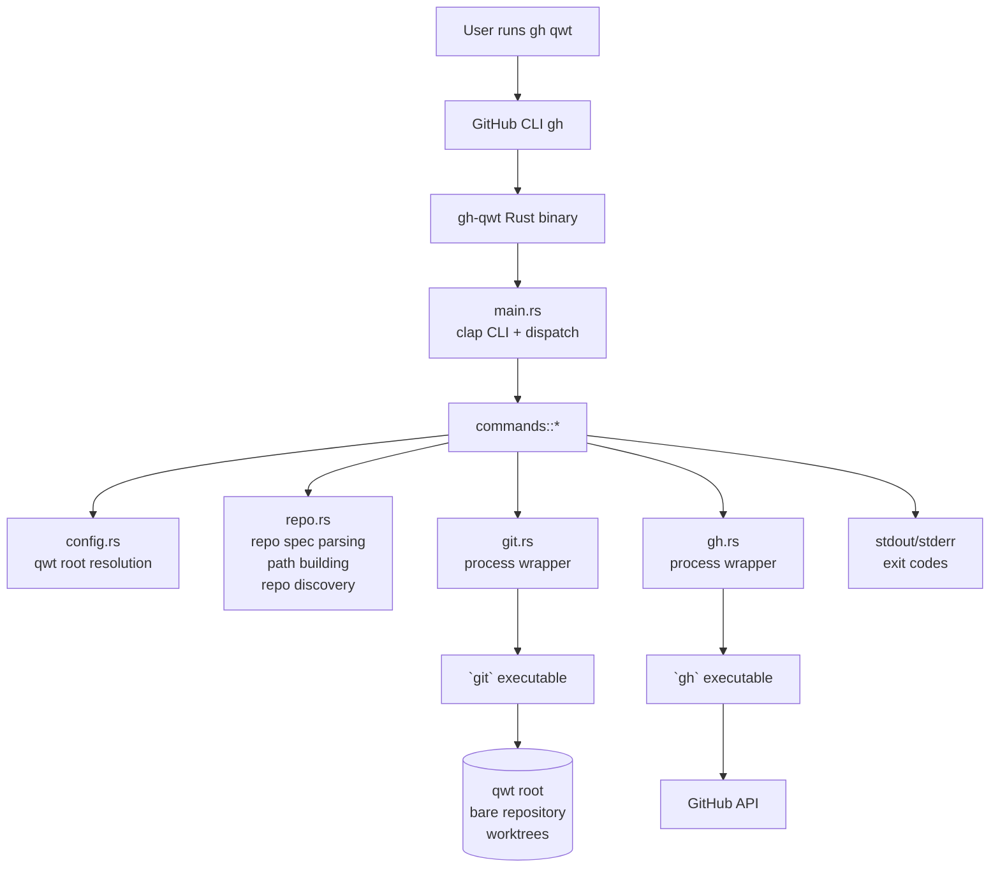
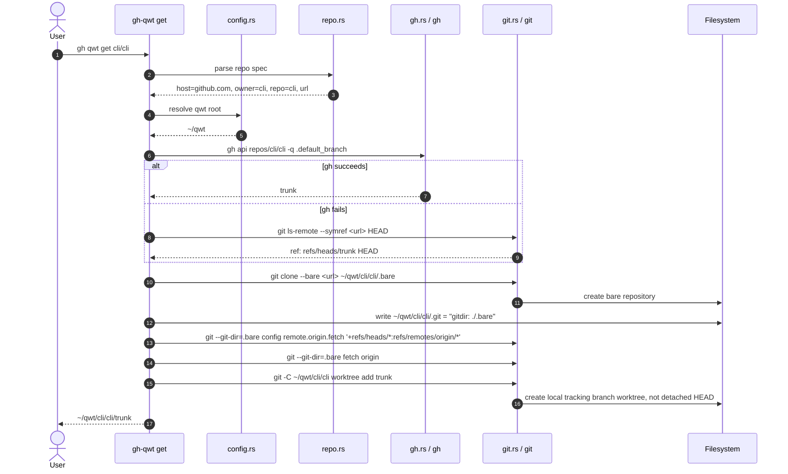
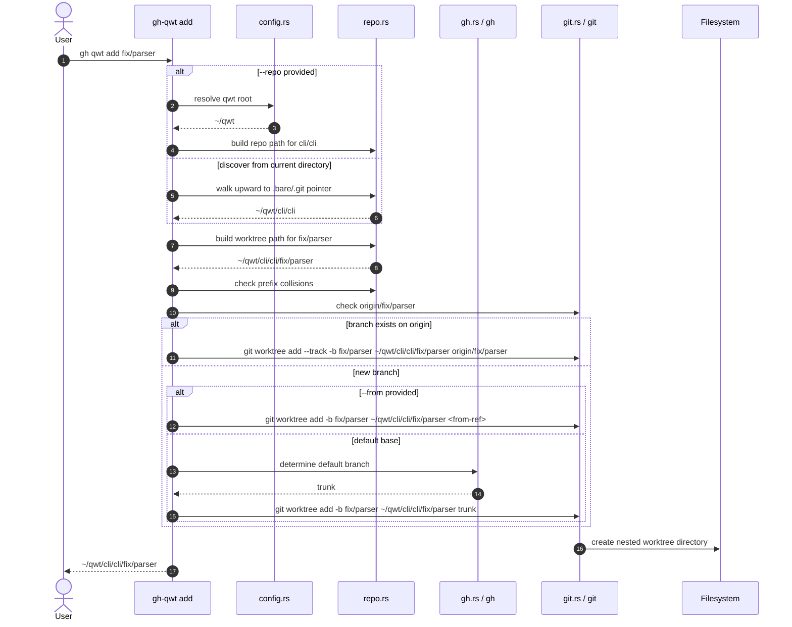

# Architecture

Developer architecture notes for `gh-qwt`, a GitHub CLI extension that manages one bare repository plus one worktree directory per branch.

## Table of contents

- [Overview](#overview)
- [Extension model](#extension-model)
- [Process strategy](#process-strategy)
- [Project structure](#project-structure)
- [Module map](#module-map)
- [Component flow](#component-flow)
- [Command sequences](#command-sequences)
  - [`get`](#get)
  - [`add`](#add)
- [Related documents](#related-documents)

## Overview

`gh-qwt` is a GitHub CLI extension invoked as `gh qwt`. It clones a repository once as a bare git database and places each branch in its own worktree directory:

```text
<qwt_root>/<owner>/<repo>/<branch>
```

For example, with qwt root `~/qwt`, repository `cli/cli`, default branch `trunk`, and feature branch `fix/parser`:

```text
~/qwt/cli/cli/trunk
~/qwt/cli/cli/fix/parser
```

The project has completed its v1 implementation: all seven commands (`get`, `add`, `list`, `rm`, `root`, `path`, `prune`) are implemented as a Rust precompiled binary named `gh-qwt`.

## Extension model

A `gh` extension is an executable on `PATH` whose name starts with `gh-`. When a user runs:

```console
$ gh qwt get cli/cli
```

GitHub CLI resolves and executes the `gh-qwt` binary. `gh-qwt` owns command parsing, dispatch, path resolution, and orchestration of `git` and `gh` subprocesses.

The binary is implemented in Rust to provide:

- a single precompiled executable for distribution;
- predictable startup behavior;
- strong typed boundaries around repo specs, paths, and command dispatch.

See [ADR 0003](../adr/0003-language-rust-precompiled-binary/) and [ADR 0004](../adr/0004-bare-repo-plus-per-branch-worktree-layout/) for the main architectural decisions.

## Process strategy

`gh-qwt` shells out to the existing `gh` and `git` executables instead of linking a GitHub or git library.

| Tool | Used for | Rationale |
| --- | --- | --- |
| `gh` | Auth-aware GitHub API calls, especially default-branch lookup. | Reuses the user's existing GitHub CLI authentication, host configuration, and enterprise setup. |
| `git` | Bare clone, fetch, worktree, branch, and ref operations. | Preserves native git behavior and portability across platforms. |

Default-branch detection is ordered:

1. `gh api repos/{owner}/{repo} -q .default_branch`
2. `git ls-remote --symref <url> HEAD`, parsing `ref: refs/heads/<name>\tHEAD`

See [ADR 0009](../adr/0009-default-branch-detection-strategy/).

## Project structure

```text
Cargo.toml            # bin name = gh-qwt; deps: clap (derive), anyhow, dirs
src/
  main.rs             # clap CLI definition + dispatch
  config.rs           # qwt root resolution
  repo.rs             # repo-spec/URL parsing, path building, repo discovery (walk up to .bare)
  git.rs              # thin wrappers over the `git` process
  gh.rs               # thin wrappers over the `gh` process (default-branch lookup)
  commands/{get,add,list,rm,root,path,prune}.rs
```

## Module map

| Module | Responsibility |
| --- | --- |
| `main.rs` | Defines the `clap` CLI, validates top-level arguments, maps invalid usage to exit code `2`, and dispatches to command modules. |
| `config.rs` | Resolves the qwt root in order: `QWT_ROOT`, `git config --get qwt.root`, then `~/qwt` with `~` expansion. |
| `repo.rs` | Parses repo specs and URLs, derives host/owner/repo/clone URL, builds `<root>/<owner>/<repo>` and worktree paths, and discovers a qwt repo root by walking upward to a directory containing `.bare` and the `.git` pointer. |
| `git.rs` | Provides thin, testable wrappers over `git` process invocations such as `clone --bare`, `fetch`, `worktree add`, `worktree list`, `worktree remove`, and branch/ref checks. |
| `gh.rs` | Provides thin wrappers over `gh` process invocations, primarily auth-aware default-branch lookup with `gh api`. |
| `commands::get` | Orchestrates initial clone, `.git` pointer creation, fetch-refspec setup, default or selected branch worktree creation, and output. |
| `commands::add` | Discovers or selects a qwt repo, decides whether the target branch exists on `origin`, creates a tracking or new-branch worktree, and detects path prefix collisions. |
| `commands::list` | Enumerates qwt-managed repositories and their git worktrees. |
| `commands::rm` | Removes one branch worktree and optionally deletes the local branch. |
| `commands::root` | Prints the resolved qwt root. |
| `commands::path` | Prints the qwt root, a repo path, or a branch worktree path without creating anything. |
| `commands::prune` | Removes an entire qwt-managed repository tree after confirmation unless forced. |

## Component flow



## Command sequences

### `get`



`get` must ensure the default branch worktree is a real local branch tracking `origin/<default_branch>`, not a detached checkout.

### `add`



Slash-separated branch names intentionally create nested directories. `add` must reject prefix collisions, such as an existing `fix` worktree conflicting with a requested `fix/parser` worktree.

## Related documents

- [Specification](../specification/)
- [Directory layout reference](../../references/directory-layout/)
- [ADR 0003: Language: Rust precompiled binary](../adr/0003-language-rust-precompiled-binary/)
- [ADR 0004: Bare repo plus per-branch worktree layout](../adr/0004-bare-repo-plus-per-branch-worktree-layout/)
- [ADR 0009: Default branch detection strategy](../adr/0009-default-branch-detection-strategy/)
