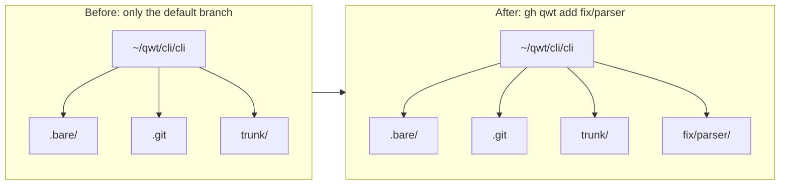

# Working with worktrees

Use this guide when you already have a repository under your **qwt root** and want to add, inspect, or remove branch worktrees.

## Table of contents

- [Mental model](#mental-model)
- [Add a worktree for a new branch](#add-a-worktree-for-a-new-branch)
- [Add a worktree for an existing remote branch](#add-a-worktree-for-an-existing-remote-branch)
- [Branches with slashes](#branches-with-slashes)
- [Run from anywhere with `--repo`](#run-from-anywhere-with---repo)
- [List worktrees](#list-worktrees)
- [Remove a worktree](#remove-a-worktree)
- [Remove an entire repo](#remove-an-entire-repo)
- [Clean up merged branches with `prune`](#clean-up-merged-branches-with-prune)
- [See also](#see-also)

## Mental model

`gh qwt` clones each GitHub repository once as a **bare repository**, then creates one **worktree** directory for each branch you want to work on. That means branches live side by side instead of replacing each other in a single checkout.

For a qwt root of `~/qwt`, the `cli/cli` repository looks like this:

```text
~/qwt/cli/cli/
  .bare/      # bare git database
  .git        # file: gitdir: ./.bare
  trunk/      # default branch worktree
```

Adding another branch creates another directory next to `trunk`.



## Add a worktree for a new branch

Start from any worktree in the repository. Here, `trunk` is the default branch:

```console
$ cd ~/qwt/cli/cli/trunk
$ gh qwt add fix/parser
~/qwt/cli/cli/fix/parser
```

When `fix/parser` does not already exist on `origin`, `gh qwt add` creates a new branch from the repository's default branch and prints the new worktree path.

> [!TIP]
> Use `--from <ref>` to create the branch from a different base, such as another branch, tag, or commit.

```console
$ gh qwt add fix/parser --from origin/trunk
~/qwt/cli/cli/fix/parser
```

## Add a worktree for an existing remote branch

If `fix/parser` already exists on `origin`, the same command creates a tracking worktree instead of a brand-new branch:

```console
$ cd ~/qwt/cli/cli/trunk
$ gh qwt add fix/parser
~/qwt/cli/cli/fix/parser
```

In this case, `gh qwt` uses the remote branch as the upstream so local commits are associated with `origin/fix/parser`.

## Branches with slashes

Branch names containing `/` become nested directories under the repository directory:

```console
$ cd ~/qwt/cli/cli/trunk
$ gh qwt add feature/login
~/qwt/cli/cli/feature/login
```

The resulting layout is:

```text
~/qwt/cli/cli/
  .bare/
  .git
  trunk/
  feature/
    login/
```

> [!WARNING]
> Branch path prefixes can collide. For example, a branch named `feat` wants `~/qwt/cli/cli/feat`, while `feat/x` wants `~/qwt/cli/cli/feat/x`. `gh qwt` detects this situation and warns before it creates an ambiguous path layout.

## Run from anywhere with `--repo`

Normally, `gh qwt add` discovers the repository by walking up from the current directory until it finds the repo root containing `.bare` or the `.git` pointer file. If you are outside a qwt worktree, pass the repository explicitly:

```console
$ gh qwt add hotfix --repo cli/cli
~/qwt/cli/cli/hotfix
```

In scripts, pass the same flag without relying on your current directory:

```bash
gh qwt add hotfix --repo cli/cli
```

| Flag | Use it when… |
| --- | --- |
| `--repo <owner>/<repo>` | You are outside the repository's qwt directory, or you want to be explicit about the target repository. |
| `--from <ref>` | You are creating a new branch and want a base other than the default branch. |

## List worktrees

Use `gh qwt list` to show known worktrees across repositories under your qwt root, as a flat,
sorted list of `owner/repo/branch` — one entry per line, with no repository headers or
indentation:

```console
$ gh qwt list
```

Sample output:

```text
cli/cli/feature/login
cli/cli/fix/parser
cli/cli/trunk
```

Because the output has no headers or indentation, it's safe to pipe directly into a fuzzy finder
or tools like `grep` and `xargs`; see the [shell integration guide](../shell-integration/#add-a-fuzzy-worktree-picker).

Use `-p` or `--full-path` when you want absolute paths suitable for copying into scripts or `cd` commands:

```console
$ gh qwt list -p
```

<details>
<summary>Sample full-path output</summary>

```text
/Users/alice/qwt/cli/cli/feature/login
/Users/alice/qwt/cli/cli/fix/parser
/Users/alice/qwt/cli/cli/trunk
```

</details>

Pass a `<query>` to filter by substring (case-insensitive unless `<query>` has an uppercase
letter):

```console
$ gh qwt list fix
cli/cli/fix/parser
```

Add `-e`/`--exact` to require `<query>` to exactly match `branch`, `repo/branch`, or
`owner/repo/branch` instead of a substring:

```console
$ gh qwt list --exact trunk
cli/cli/trunk
```

| Flag | Output |
| --- | --- |
| none | Flat `owner/repo/branch` list. |
| `-e`, `--exact` | Requires `<query>` to exactly match `branch`, `repo/branch`, or `owner/repo/branch` (no effect without a `<query>`). |
| `-p`, `--full-path` | Absolute worktree paths instead of `owner/repo/branch`. |

## Remove a worktree

Remove a branch worktree from inside the repository:

```console
$ cd ~/qwt/cli/cli/trunk
$ gh qwt remove fix/parser
```

`rm` is an alias for `remove`, so `gh qwt rm fix/parser` does exactly the same thing. By default,
this removes the worktree directory. Use flags when you need stronger cleanup behavior:

```console
$ gh qwt remove fix/parser --force
$ gh qwt remove fix/parser --delete-branch
```

| Flag | Effect |
| --- | --- |
| `--force` | Removes the worktree even when it has local changes. |
| `--delete-branch` | Deletes the local branch after removing the worktree. |

> [!WARNING]
> `--force` can discard uncommitted work. Check `git status` in the worktree before using it.

You don't have to `cd` into the repository first: from anywhere, name the worktree explicitly with
`owner/repo/branch`:

```console
$ gh qwt remove cli/cli/fix/parser
```

## Remove an entire repo

Use `remove`/`rm` with just `owner/repo` (no branch) to remove the whole repository tree from the
qwt root — this only works when you are *not* standing inside another qwt repository:

```console
$ gh qwt remove cli/cli
```

This removes all worktrees for `cli/cli` and the `.bare` repository database.

> [!CAUTION]
> `gh qwt remove cli/cli` deletes `~/qwt/cli/cli/` entirely. It asks for confirmation unless you pass `--force`. See the [`remove` CLI reference](../../references/cli/#remove) before using it.

## Clean up merged branches with `prune`

Once you merge a pull request and GitHub deletes its source branch, the local worktree for that
branch is left behind. `prune` cleans those up automatically — it's modeled on real git's own
`git worktree prune` and `git fetch --prune`, not on deleting a whole repository:

```console
$ cd ~/qwt/cli/cli/trunk
$ gh qwt prune
Fetching origin...
The following worktrees are no longer on the remote and will be removed:
  fix/parser
Remove these worktrees and their local branches? [y/N]
```

`prune` takes no argument — like `git worktree prune`, it always works on the repository you're
currently in. It only removes a worktree when its branch *had* a remote counterpart that is now
gone; a branch you never pushed is left alone, and a worktree with uncommitted changes is skipped
and reported instead of being force-removed. Pass `-y`/`--force` to skip the confirmation prompt.

## See also

- [Getting started](../getting-started/)
- [CLI reference](../../references/cli/)
- [Directory layout reference](../../references/directory-layout/)
