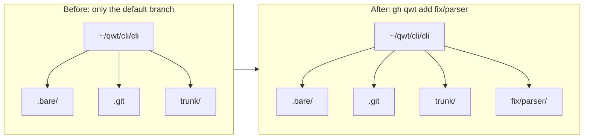

# Working with worktrees

Use this guide when you already have a repository under your **qwt root** and want to add, inspect, or remove branch worktrees.

## Table of contents

- [Mental model](#mental-model)
- [Add a worktree for a new branch](#add-a-worktree-for-a-new-branch)
- [Create and enter a worktree](#create-and-enter-a-worktree)
- [Add a worktree for an existing remote branch](#add-a-worktree-for-an-existing-remote-branch)
- [Branches with slashes](#branches-with-slashes)
- [Run from anywhere with `--repo`](#run-from-anywhere-with---repo)
- [List worktrees](#list-worktrees)
- [Remove a worktree](#remove-a-worktree)
- [Remove an entire repo](#remove-an-entire-repo)
- [See also](#see-also)

## Mental model

`gh qwt` clones each GitHub repository once as a **bare repository**, then creates one **worktree** directory for each branch you want to work on. That means branches live side by side instead of replacing each other in a single checkout.

For a qwt root of `~/qwt`, the `cli/cli` repository looks like this:

```text
~/qwt/cli/cli/
  .bare/      # bare git database
  .git        # file: gitdir: ./.bare
  trunk/      # default branch worktree
```

Adding another branch creates another directory next to `trunk`.



## Add a worktree for a new branch

Start from any worktree in the repository. Here, `trunk` is the default branch:

```console
$ cd ~/qwt/cli/cli/trunk
$ gh qwt add fix/parser
~/qwt/cli/cli/fix/parser
```

When `fix/parser` does not already exist on `origin`, `gh qwt add` creates a new branch from the repository's default branch and prints the new worktree path.

> [!TIP]
> Use `--from <ref>` to create the branch from a different base, such as another branch, tag, or commit.

```console
$ gh qwt add fix/parser --from origin/trunk
~/qwt/cli/cli/fix/parser
```

## Create and enter a worktree

To start working in a new branch immediately, capture `add`'s output and change directories only
when creation succeeds.

### Bash and zsh

```bash
$ cd ~/qwt/cli/cli/trunk
worktree="$(gh qwt add fix/lexer)" && cd "$worktree"
```

### Fish

```fish
cd ~/qwt/cli/cli/trunk
set worktree (gh qwt add fix/lexer); and cd "$worktree"
```

On success, `gh qwt add` writes only the new worktree's path to standard output. Both forms run
`cd` in your current shell only when `add` succeeds. Do not use
`gh qwt add fix/parser | cd`: commands in a pipeline run outside the parent shell, so that form
cannot change your current directory.

## Add a worktree for an existing remote branch

If `fix/parser` already exists on `origin`, the same command creates a tracking worktree instead of a brand-new branch:

```console
$ cd ~/qwt/cli/cli/trunk
$ gh qwt add fix/parser
~/qwt/cli/cli/fix/parser
```

In this case, `gh qwt` uses the remote branch as the upstream so local commits are associated with `origin/fix/parser`.

## Branches with slashes

Branch names containing `/` become nested directories under the repository directory:

```console
$ cd ~/qwt/cli/cli/trunk
$ gh qwt add feature/login
~/qwt/cli/cli/feature/login
```

The resulting layout is:

```text
~/qwt/cli/cli/
  .bare/
  .git
  trunk/
  feature/
    login/
```

> [!WARNING]
> Branch path prefixes can collide. For example, a branch named `feat` wants `~/qwt/cli/cli/feat`, while `feat/x` wants `~/qwt/cli/cli/feat/x`. `gh qwt` detects this situation and warns before it creates an ambiguous path layout.

## Run from anywhere with `--repo`

Normally, `gh qwt add` discovers the repository by walking up from the current directory until it finds the repo root containing `.bare` or the `.git` pointer file. If you are outside a qwt worktree, pass the repository explicitly:

```console
$ gh qwt add hotfix --repo cli/cli
~/qwt/cli/cli/hotfix
```

In scripts, pass the same flag without relying on your current directory:

```bash
gh qwt add hotfix --repo cli/cli
```

To create and enter it from anywhere in an interactive shell, use the same flag inside command
substitution:

```bash
worktree="$(gh qwt add --repo cli/cli hotfix)" && cd "$worktree"
```

| Flag | Use it when… |
| --- | --- |
| `--repo <owner>/<repo>` | You are outside the repository's qwt directory, or you want to be explicit about the target repository. |
| `--from <ref>` | You are creating a new branch and want a base other than the default branch. |

## List worktrees

Use `gh qwt list` to show known worktrees across repositories under your qwt root:

```console
$ gh qwt list
```

Sample output:

```text
cli/cli  trunk          ~/qwt/cli/cli/trunk
cli/cli  fix/parser     ~/qwt/cli/cli/fix/parser
cli/cli  feature/login  ~/qwt/cli/cli/feature/login
```

Use `-p` or `--full-path` when you want absolute paths suitable for copying into scripts or `cd` commands:

```console
$ gh qwt list -p
```

<details>
<summary>Sample full-path output</summary>

```text
/Users/alice/qwt/cli/cli/trunk
/Users/alice/qwt/cli/cli/fix/parser
/Users/alice/qwt/cli/cli/feature/login
```

</details>

| Flag | Output |
| --- | --- |
| none | Worktree list using the default display format. |
| `-p`, `--full-path` | Absolute worktree paths. |

## Remove a worktree

Remove a branch worktree from inside the repository:

```console
$ cd ~/qwt/cli/cli/trunk
$ gh qwt rm fix/parser
```

By default, this removes the worktree directory. Use flags when you need stronger cleanup behavior:

```console
$ gh qwt rm fix/parser --force
$ gh qwt rm fix/parser --delete-branch
```

| Flag | Effect |
| --- | --- |
| `--force` | Removes the worktree even when it has local changes. |
| `--delete-branch` | Deletes the local branch after removing the worktree. |

> [!WARNING]
> `--force` can discard uncommitted work. Check `git status` in the worktree before using it.

## Remove an entire repo

Use `prune` only when you want to remove the whole repository tree from the qwt root:

```console
$ gh qwt prune cli/cli
```

This removes all worktrees for `cli/cli` and the `.bare` repository database.

> [!CAUTION]
> `gh qwt prune cli/cli` deletes `~/qwt/cli/cli/` entirely. It asks for confirmation unless you pass `-y` or `--force`. See the [`prune` CLI reference](../../references/cli/#prune) before using it.

## See also

- [Getting started](../getting-started/)
- [CLI reference](../../references/cli/)
- [Directory layout reference](../../references/directory-layout/)
