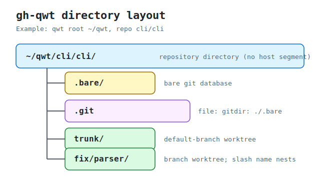
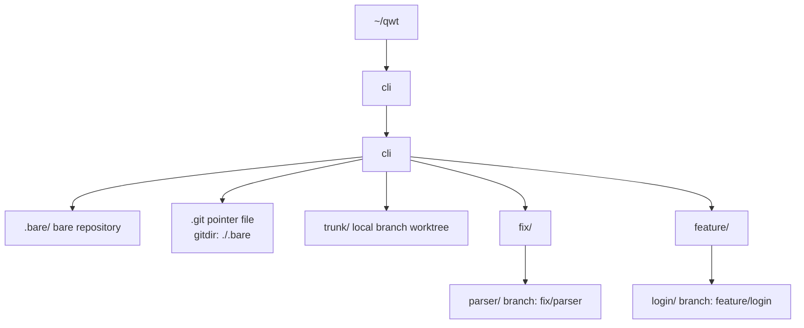

# Directory layout reference

Normative reference for the on-disk layout created by `gh qwt`.

## Table of contents

- [Canonical layout](#canonical-layout)
- [Diagram](#diagram)
- [Entries](#entries)
- [Git mechanics](#git-mechanics)
- [Branch path mapping](#branch-path-mapping)
- [Alternate view](#alternate-view)
- [See also](#see-also)

## Canonical layout

`gh qwt` stores repositories below the resolved [qwt root](../glossary/#qwt-root) using this path shape:

```text
<qwt_root>/<owner>/<repo>/<branch>
```

There is no host segment in the path. With qwt root `~/qwt`, repo spec `cli/cli`, default branch `trunk`, and feature branches `fix/parser` and `feature/login`, the layout is:

```text
~/qwt/cli/cli/
  .bare/              # bare git database (git clone --bare)
  .git                # file containing exactly: gitdir: ./.bare
  trunk/              # default-branch worktree created by gh qwt get
  fix/parser/         # feature-branch worktree created by gh qwt add
  feature/login/      # slash branch names nest as directories
```

## Diagram



## Entries

| Entry | Type | Description |
| --- | --- | --- |
| `.bare/` | Directory | Bare repository database created by `git clone --bare`. It stores objects, refs, and worktree metadata for the qwt-managed repository. |
| `.git` | File | Git pointer file whose contents are exactly:<br><br>`gitdir: ./.bare` |
| `<default_branch>/` | Directory | Worktree for the repository default branch, such as `trunk/`, created by `gh qwt get`. It checks out a real local branch, not a detached `HEAD`. |
| `<feature_branch>/` | Directory | Worktree for another branch, such as `fix/parser/` or `feature/login/`, created by `gh qwt add`. Slash-separated branch names map to nested directories. |

## Git mechanics

The `.git` pointer file uses a relative target:

```text
gitdir: ./.bare
```

Because the target is relative, the repository directory is relocatable as long as `.git`, `.bare/`, and the worktree directories move together.

A bare clone does not set a fetch refspec by default. After cloning, `gh qwt get` sets:

```console
$ git config remote.origin.fetch '+refs/heads/*:refs/remotes/origin/*'
```

Then it fetches so remote-tracking branches such as `origin/trunk` and `origin/fix/parser` are populated.

Worktrees are real checked-out branches. The default-branch worktree checks out a local branch named for the default branch, such as `trunk`, rather than leaving the worktree in a detached `HEAD` state.

## Branch path mapping

Branch names containing `/` create nested directories below the repository directory:

| Branch | Worktree path |
| --- | --- |
| `trunk` | `~/qwt/cli/cli/trunk` |
| `fix/parser` | `~/qwt/cli/cli/fix/parser` |
| `feature/login` | `~/qwt/cli/cli/feature/login` |

> [!WARNING]
> Branch names can collide by path prefix. For example, a branch named `feat` needs `~/qwt/cli/cli/feat` as a worktree directory, while `feat/x` needs `~/qwt/cli/cli/feat/` as a parent directory. These two paths cannot both represent worktree directories at the same time.

## Alternate view



## See also

- [Specification](../../development/specification/) for normative command behavior.
- [Glossary](../glossary/) for definitions of qwt terms.
- [CLI reference](../cli/) for command-specific layout effects.
